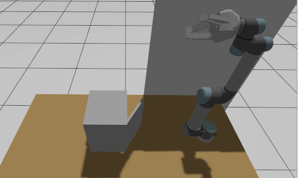

# UR5 Cabinet Opener: Constrained Motion Planning & Articulated Object Manipulation in ROS 2 & MoveIt 2

An autonomous robotic manipulation pipeline for articulated cabinet door opening using a 6-DOF Universal Robots UR5 manipulator and a Robotiq 3-Finger Adaptive Gripper. Built on ROS 2 and MoveIt 2, the system models revolute joint kinematics, enforces geometric workspace constraints, and executes a two-phase motion planning strategy combining constrained point-to-point (PTP) motion with cartesian arc trajectory generation.

## Demonstration

<p align="center">
  
  <br>
  <em>Autonomous execution: Constrained PTP pre-grasp approach followed by circular Cartesian trajectory tracking to open the cabinet door by 75°.</em>
</p>

---

## Table of Contents

- [System Architecture & Kinematics](#system-architecture--kinematics)
  - [Articulated Object Modeling](#articulated-object-modeling)
  - [Two-Phase Motion Planning Strategy](#two-phase-motion-planning-strategy)
  - [Collision Scene Management](#collision-scene-management)
- [Key Features](#key-features)
- [Repository Structure](#repository-structure)
- [Tech Stack](#tech-stack)
- [Prerequisites & Dependencies](#prerequisites--dependencies)
- [Installation & Build](#installation--build)
- [Usage & Execution](#usage--execution)
  - [1. Launching the Simulation Environment](#1-launching-the-simulation-environment)
  - [2. Running the Autonomous Manipulation Node](#2-running-the-autonomous-manipulation-node)
  - [3. Hardware Deployment (Optional)](#3-hardware-deployment-optional)
- [License](#license)

---

## System Architecture & Kinematics

Opening a hinged cabinet door is a kinematically constrained manipulation task: the end-effector must follow a circular arc dictated by the door's hinge axis while maintaining safe clearance from static obstacles (table, protective wall, cabinet frame).

```
[World Frame W] ──> [Cabinet Origin O] ──> [Hinge Axis A] ──R_z(θ)──> [Door Edge D] ──> [Grasp Frame G]
```

### Articulated Object Modeling

The cabinet kinematics are parameterized using homogeneous transformation matrices defined with respect to the door geometry and hinge location ($S_A$):

1. **World to Cabinet Origin:** $T_{O}^{W}$ maps the spawned position ($x=0.0$, $y=0.15$, $z=0.998$) and yaw orientation ($\psi = -1.57 \text{ rad}$).
2. **Hinge Joint Rotation:** For each displacement angle $\theta \in [\theta_{\text{start}}, \theta_{\text{target}}]$, the hinge transformation is updated via:

```math
R_z(\theta) = \begin{bmatrix}
\cos\theta & -\sin\theta & 0 & 0 \\
\sin\theta & \cos\theta & 0 & 0 \\
0 & 0 & 1 & 0 \\
0 & 0 & 0 & 1
\end{bmatrix}
```

4. **Forward Kinematic Chain:** The target grasp pose in world coordinates $T_{G}^{W}$ is computed dynamically along the arc:

$$
T_{G}^{W} = T_{O}^{W} \cdot T_{A}^{O} \cdot R_z(\theta) \cdot T_{D}^{A} \cdot T_{G}^{D}
$$

   where $T_{G}^{D}$ defines an approach vector positioned behind the door panel with a $-45^\circ$ approach angle offset for stable contact during pulling.

### Two-Phase Motion Planning Strategy

```
                          ┌────────────────────────────────────────┐
                          │ Phase 1: Constrained PTP Approach      │
                          │ - MoveGroup Action (OMPL / RRTConnect) │
                          │ - Position Constraint (5cm tolerance)  │
                          │ - Orientation Constraint (0.1 rad tol) │
                          └───────────────────┬────────────────────┘
                                              │ Success
                                              ▼
                          ┌────────────────────────────────────────┐
                          │ Phase 2: Circular Cartesian Trajectory │
                          │ - compute_cartesian_path Service       │
                          │ - Δθ = -75° Arc Sweep                  │
                          │ - Resolution: max_step = 0.01 m        │
                          │ - Acceptance Threshold: fraction ≥ 0.9 │
                          └───────────────────┬────────────────────┘
                                              │ Success
                                              ▼
                          ┌────────────────────────────────────────┐
                          │ Execution: Trajectory Controller       │
                          │ - execute_trajectory Action Client     │
                          │ - Smooth continuous door opening       │
                          └────────────────────────────────────────┘
```

1. **Phase 1: Constrained Free-Space PTP (`MoveGroup`):**
   - Directs the arm (`tool0`) from its rest pose to the initial pre-grasp pose ($start\_angle = -30^\circ$).
   - Enforces tight 3D bounding box `PositionConstraint` ($\pm 0.05 \text{ m}$) and `OrientationConstraint` ($\pm 0.1 \text{ rad}$ tolerance on all axes) to prevent collisions with the surrounding wall and tabletop during path generation.
2. **Phase 2: Cartesian Arc Path (`compute_cartesian_path`):**
   - Samples 10 discrete kinematic poses along the circular opening arc ($\Delta\theta = -75^\circ$).
   - Evaluates trajectory validity using fine spatial resolution (`max_step = 0.01 m`) and zero jump threshold (`jump_threshold = 0.0`) to avoid joint singularities.
   - Enforces a safety cutoff requiring $\ge 90\%$ path completion before dispatching commands to `execute_trajectory`.

### Collision Scene Management

To prevent self-collision and environment penetration, collision geometries are published to the planning scene via `moveit_msgs/msg/CollisionObject`:
- **`cabinet_body`**: Bounding box ($0.30 \times 0.35 \times 0.37 \text{ m}$) preventing the robot from sweeping through the interior or side panels of the cupboard.
- **`blocker`**: Static collision barrier enforcing realistic approach direction constraints.

---

## Key Features

- **Kinematic Contact Modeling:** Analytical calculation of end-effector waypoints constrained to a revolute door axis.
- **Singularity-Free Cartesian Tracking:** Smooth interpolation along circular task-space paths without joint flips or jerky velocity spikes.
- **Robust MoveIt 2 Integration:** Native ROS 2 Action and Service client architecture using `rclpy`.
- **Fault-Tolerant Execution:** Automated fallback logic and replanning on trajectory rejection or planning failure.
- **Digital Twin & Real-World Parity:** Configured for Gazebo Sim with identical joint limit and kinematic definitions as real Universal Robots CB3 controllers.

---

## Repository Structure

```
ur5_robotiq_sim/
├── docs/
│   └── cabinet_opening_demo.gif       # Execution demo animation
├── launch/
│   ├── lv3_spawner.launch.py          # Spawns table, wall, UR5, gripper, and cabinet in Gazebo/RViz
│   ├── ur5_robot_sim_moveit.launch.py # Core simulation launch file with MoveIt 2 stack
│   └── ur5_rsp.launch.py              # Robot state publisher configuration
├── scripts/
│   ├── open_cabinet.py                # Main autonomous node (CabinetOpenerSolver)
│   └── cabinet_model.py               # Analytical cabinet kinematic model & URDF generator
├── urdf/
│   ├── ur_gz.xacro                    # Complete robot, gripper, and environment Xacro description
│   └── ur_real.xacro                  # Hardware-specific description for real UR5
├── config/
│   └── ros2_controllers.yaml          # Joint trajectory and impedance controller parameters
├── package.xml
├── CMakeLists.txt / setup.py
└── README.md
```

---

## Tech Stack

| Category | Technology | Purpose |
|---|---|---|
| **Middleware** | ROS 2 (Jazzy / Iron / Humble) | Distributed communication, action clients, services |
| **Motion Planning** | MoveIt 2 (`moveit_msgs`) | PTP constrained planning, Cartesian trajectory solving |
| **Simulation** | Gazebo Sim / RViz2 | Physics simulation, sensor modeling, trajectory visualizer |
| **Hardware / Drivers** | Universal Robots UR5, Robotiq 3-Finger | Manipulator arm & multi-articulated adaptive gripper |
| **Mathematics & Transforms** | NumPy, `tf_transformations` | Quaternions, Euler conversions, homogeneous matrices |
| **Language** | Python 3 | Core node logic (`rclpy`) |

---

## Prerequisites & Dependencies

Install the required ROS 2 packages and drivers:

```bash
sudo apt update && sudo apt install -y \
  ros-${ROS_DISTRO}-ur \
  ros-${ROS_DISTRO}-ur-simulation-gz \
  ros-${ROS_DISTRO}-moveit \
  ros-${ROS_DISTRO}-moveit-msgs \
  ros-${ROS_DISTRO}-tf-transformations \
  python3-pip

pip install numpy transformations
```

---

## Installation & Build

### 1. Clone the workspace

```bash
git clone https://github.com/valentinveselcic/UR5-Cabinet-Opener.git
```

### 2. Build the workspace

```bash
cd ~/UR5-Cabinet-Opener
colcon build --symlink-install
source install/setup.bash
```

---

## Usage & Execution

### 1. Launching the Simulation Environment

Spawn the UR5 robot mounted on a table, adjacent to a wall, facing the cabinet in Gazebo and RViz2:

```bash
ros2 launch ur5_robotiq_sim lv3_spawner.launch.py
```

*Wait until the Gazebo physics server is unpaused and MoveIt's `move_action` and `compute_cartesian_path` servers report ready.*

### 2. Running the Autonomous Manipulation Node

In a separate terminal, launch the trajectory generation and execution client:

```bash
source ~/ros2_ws/install/setup.bash
ros2 run ur5_robotiq_sim open_cabinet
```


## License

This project is licensed under the [MIT License](LICENSE).
